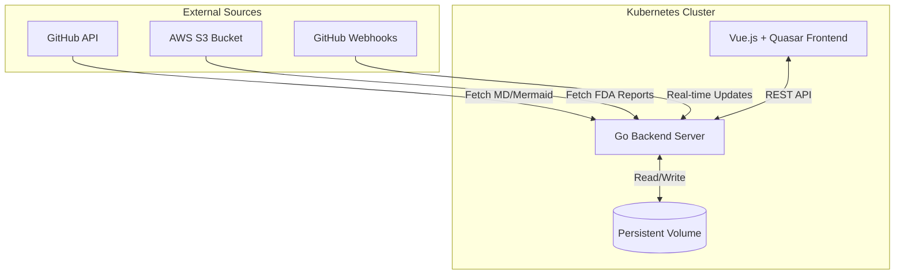

# NeuroBell Internal Documentation Platform

A full-stack documentation and report management system developed during a six-month software engineering internship at **NeuroBell**. The platform automates the aggregation of technical documentation and clinical reports into a unified, searchable web interface.

## System Architecture and Logic

The platform is built on a **Sync-and-Serve** architecture, ensuring that the documentation viewed by the engineering team is always identical to the source code repositories.

### 1. Automated GitHub Synchronization
* **Startup Sync:** On initialization, the Go backend clones specific Markdown and Mermaid files from the NeuroBell GitHub organization, replicating the repository structure locally within the container.
* **Webhook Integration:** Configured a Go-based webhook listener to subscribe to `push` and `commit` events. This ensures that any change made by a developer in a GitHub README or design document is reflected in the platform in real-time.
* **Data Persistence:** To prevent data loss during pod restarts in the Kubernetes cluster, I implemented **Persistent Volumes (PV)** and **Persistent Volume Claims (PVC)**. This separates the application logic from the storage layer.

### 2. Clinical Report Management (AWS S3)
* The platform serves as a secure portal for FDA reports.
* **On-demand Retrieval:** Used the **AWS SDK for Go** to fetch PDF and HTML files from private S3 buckets.
* **Logical Separation:** I engineered a directory logic that differentiates between "Source-of-Truth" files (S3/GitHub) and user-uploaded files, ensuring that only user-uploaded content is eligible for deletion to maintain data integrity.

### 3. Frontend Architecture (Vue 3 + Quasar)
* **Dynamic Rendering:** Implemented `VueMarkdown` and `Mermaid.js` integration to render complex architectural diagrams directly in the browser.
* **Interactive Navigation:** Utilized `grapoza/vue-tree` to build a file explorer that mirrors the GitHub repository hierarchy.
* **UX Optimizations:** * **Debouncing:** Implemented debouncing on file-upload name checks to reduce API overhead.
    * **QA Flagging:** Developed a backend logic that flags "short files" (under 20 lines) in red within the UI to highlight incomplete documentation for the Quality Assurance team.

---

## Tech Stack 

### **Backend (Go)**
* **HTTP Server:** Built using standard library and optimized routing.
* **Security:** Implemented path-traversal protection for file uploads and restricted API endpoints to prevent unauthorized file manipulation.
* **Testing:** Developed unit tests using the "Learn Go With Tests" methodology to ensure high code coverage.

### **Frontend (Vue.js & TypeScript)**
* **Component Design:** Built reusable UI components for file previews and search suggestions.
* **Application Work:** Contributed to the core NeuroBell app by building configurable data filters and a **Multi-Factor Authentication (MFA)** setup page with QR code generation.

### **DevOps and Testing**
* **Orchestration:** Wrote Kubernetes manifests for deployment, services, and volume management.
* **E2E Testing:** Authored **Playwright** scripts to simulate critical user flows, ensuring that the documentation pipeline remained stable across updates.

---

## Impact and Learning

* **Process Improvement:** Reduced the time engineers spent searching for quality documentation by centralizing distributed GitHub READMEs into a single searchable UI.
* **Technical Growth:** Successfully navigated a steep learning curve in **Kubernetes** and **Go**, moving from classroom theory to deploying a production-ready internal tool.
* **Med-Tech Compliance:** Gained insight into the rigorous documentation standards required for FDA-regulated medical devices.

---
*This project was completed as part of the BSc Computer Science programme at University College Cork (UCC).*
